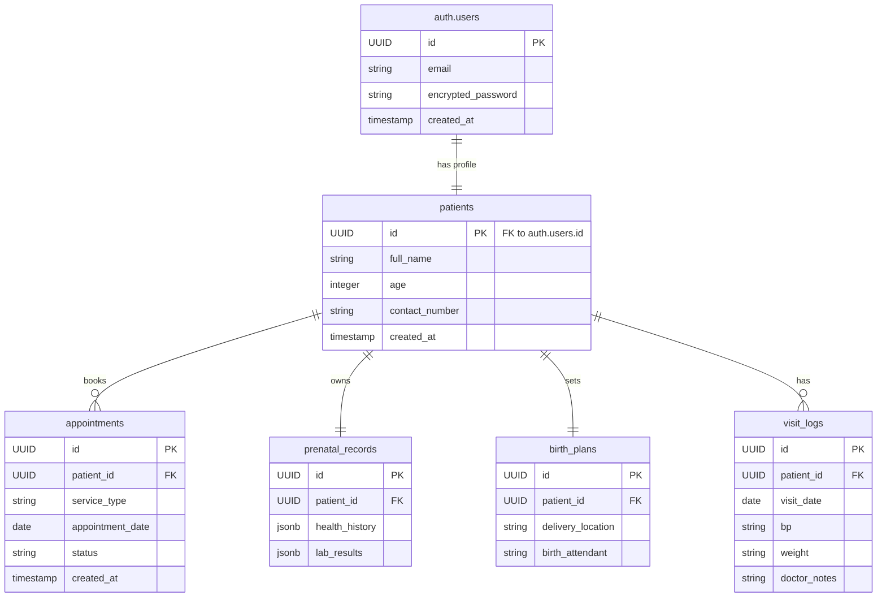

# AR-JEN Clinic System - Entity Relationship Diagram

This diagram outlines the foundational database schema for the AR-JEN Clinic System.
It utilizes Supabase's native `auth.users` for authentication, heavily relying on the unique `UUID` to establish relationships across our custom tables.

